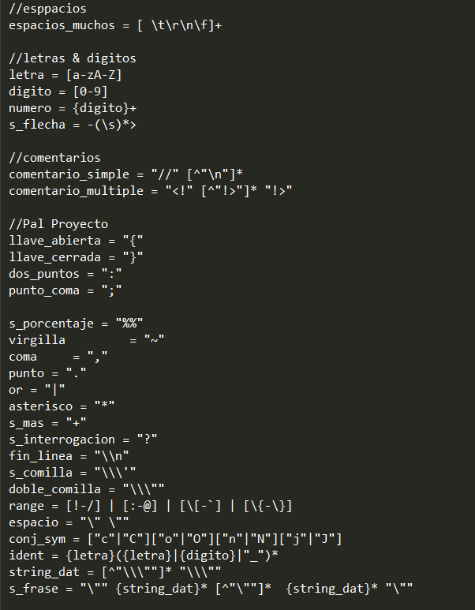
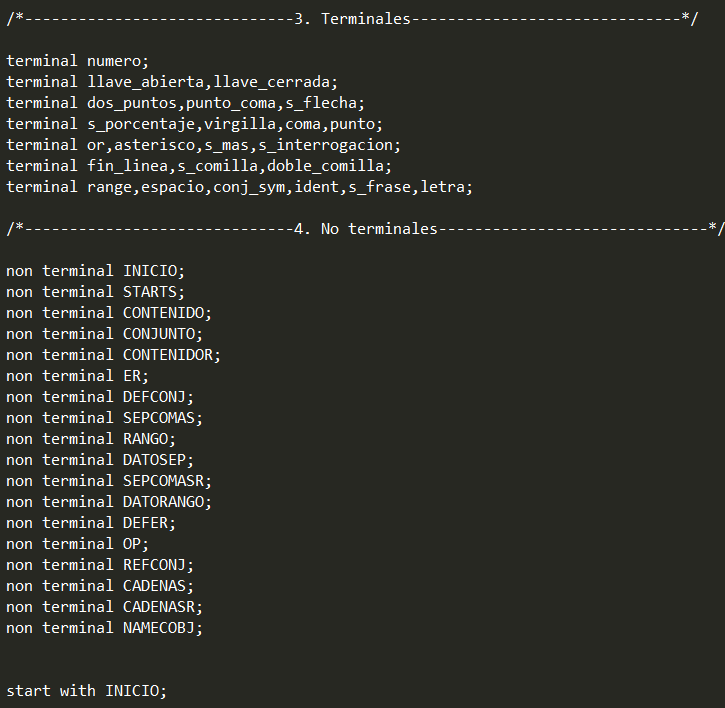
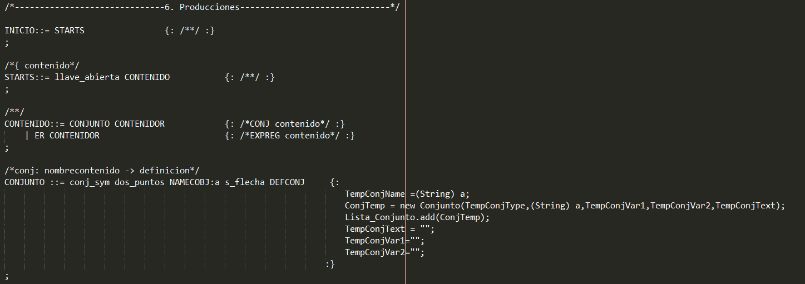
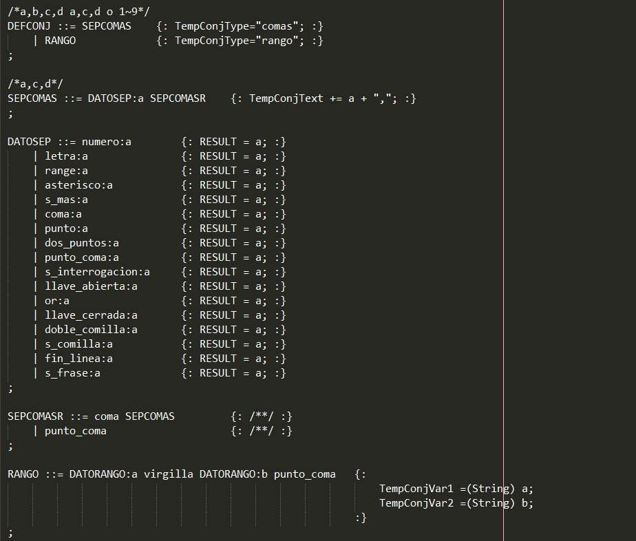
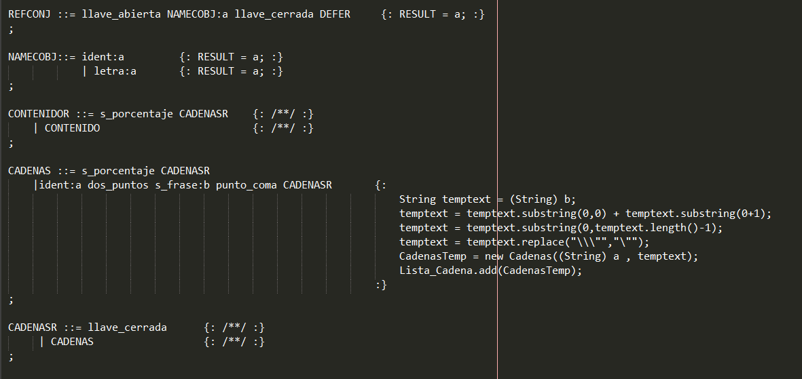
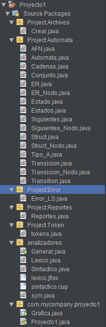
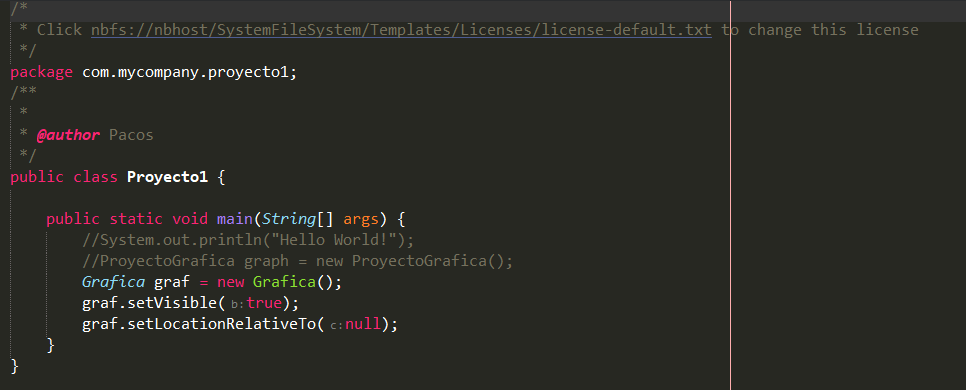
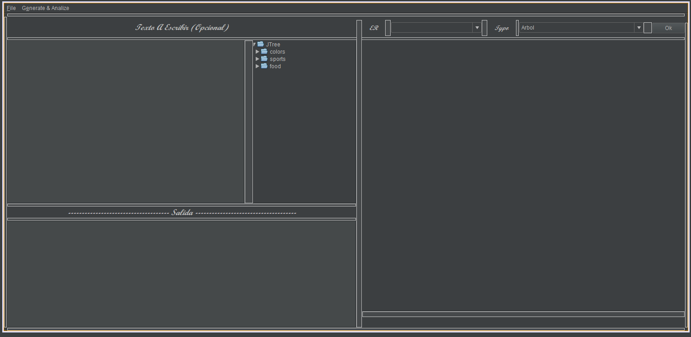

| Nombre | Carné | Fecha Entrega |
|:-:|:-:|:-:|
|Juan Urbina| 201906051| 17-03-2023 |
# Proyecto 1
## Manual Técnico
### Introducción
<p style="text-align: justify;">
Dentro del primer proyecto del laboratorio de Organización de Lenguajes  & Compiladores 1 la aplicación realizada fue en base al uso de JFlex y Cup en el lenguaje de programación Java, abordando los conceptos de gramáticas y expresiones regulares para la creación de lo que es el análisis léxico y sintáctico para analizar por consiguiente las cadenas o el archivo de prueba respectivo, la utilización de listas enlazadas para el almacenamiento de los errores, & tokens que son almacenados para su utilización en los que son los árboles y tablas graficadas posteriormente; utlizando asimismo el modo gráfico para obtener aparte de los archivos, generar, graficas, nuevos documentos y observar las imagenes de las expresiones regulares aceptadas.

Se empleo el lenguaje de programación Java como herramienta en la función de las estructuras y analisis, para almacenar la información que la interfaz gráfica le enviaba, y la interfaz gráfica se utilizaba para la obtención y envío de información a las estructuras/actualización de tokens y realización gráficas; se utilizó Graphviz para graficar las estructuras de las tablas0 y árboles.

Se pudo determinar que la implementación de las estructuras y el almacenamiento y/o arreglo de la información obtenida en cada una de ellas no mostro ningún problema durante su ejecución.</p>

&nbsp;
### Requisitos del Sistema


>- **_Sistema Operativo:_** Windows 7 o superior
>- **_CPU:_** Intel Pentium D o AMD Athlon 64 (K8) 2.6GHz. (Requisitos Mínimo)
>- **_RAM:_** 600MB
>- **_Lenguaje Utilizado:_** Java
>- **_IDE:_** NetBeans 16
>- **_JDK:_** 19.0 (Open JDK)
>- **_Versión Java:_** 19.0
&nbsp;
### Requisitos En el Proyecto (Dependencias Proyecto hecho en MAVEN)


>- **_Versioó CUP:_** 11-b
>- **_Versión CUP-Runtime:_** 11-b
>- **_Versión Gson:_** 2.8.9
>- **_Versión JFlex:_** 1.9.0
>- **_Versión json-simple:_** 1.1.1

&nbsp;
### Explicación del Código
&nbsp;
#### Analisis Léxico
```
Utiliza las siguientes expresiones regulares para obtener los parámetros a la hora de leer el archivo, obteniendo los errores
léxicos que tenga el archivo.
```
&nbsp;

&nbsp;
#### Análisis Sintáctico
```
Se encarga de obtener los errores sintácticos y mediante una gramática regular cada en cada producción obtener los datos
requeridos.

Se analizarán las cadenas y separarán los tokens para verificarlos posteriormente.
```
&nbsp;





&nbsp;

#### Codigo Java
```
Obtendrá los tokens ingresados, formará los arboles y tablas y analizará o mostrará si la cadena es valida o no es valida.
```
&nbsp;

&nbsp;
```
Por tener varias clases en java se dará un recorrido breve por cada uno:
```
- Las clases que terminen con "nodo" son los nodos que utilizarán las principales para la formación de las tablas y los arboles.
- Las clases AFN, Conjunto, Siguientes, Struct & ER se encargan de recopilar la información y hacer los grafos que obtendrá de las otras clases respectivas.
- La clase Reportes se encarga de hacer el archivo HTML de los errores.
- La clase Proyecto1 solo corre la clase Grafica, que es la que tiene el modo gráfico.
&nbsp;

&nbsp;
>Gráfica del Proyecto
&nbsp;

&nbsp;
```
Consta de 2 pestañas, 'File' y 'Generate & Analize', tambien tiene 2 combobox para la búsqueda de las imagenes y mostrarlas.
```
#### File
>Nuevo: Crea un nuevo archivo con extención olc.
&nbsp;
>Open: Abre un menu desplegable en la carpeta de archivos para abrir archivos de extención olc. 
&nbsp;
>Save: Guarda el achivo con extención olc.
&nbsp;
>Save As: Guarda un nuevo archivo con extención olc.
&nbsp;
>Exit: Sale del programa.
&nbsp;
---
## Manual de Usuario