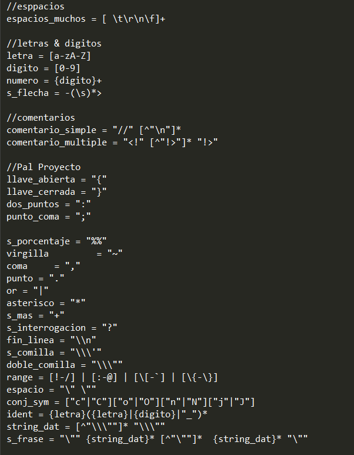
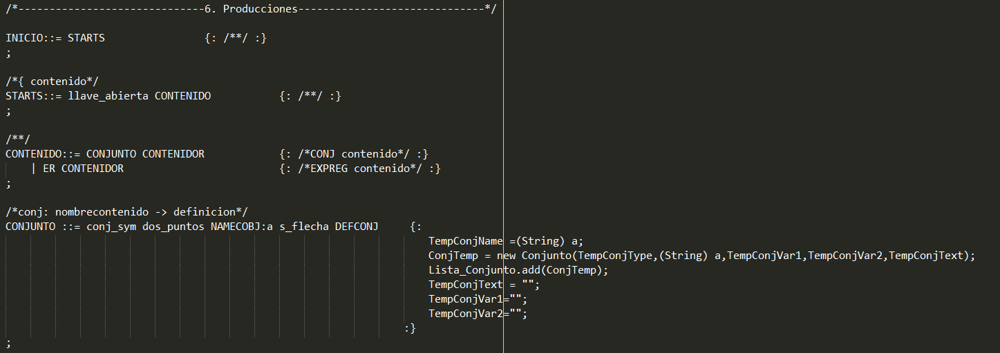
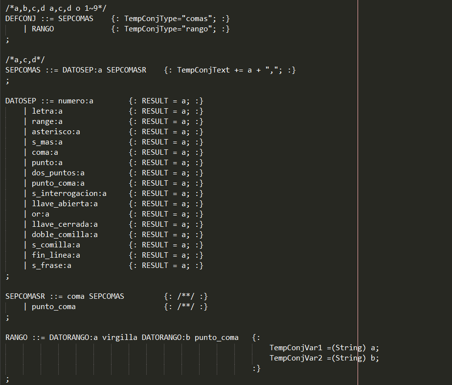
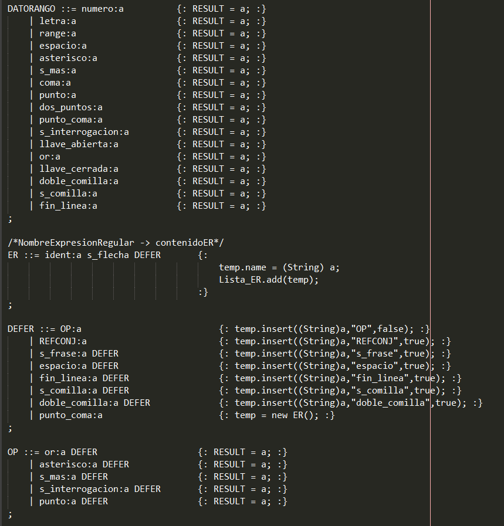
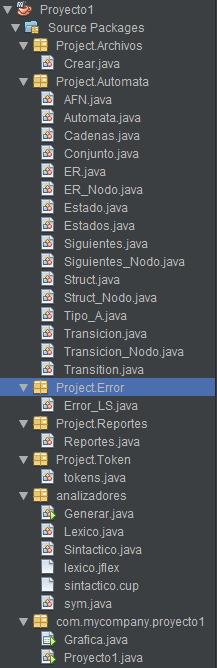
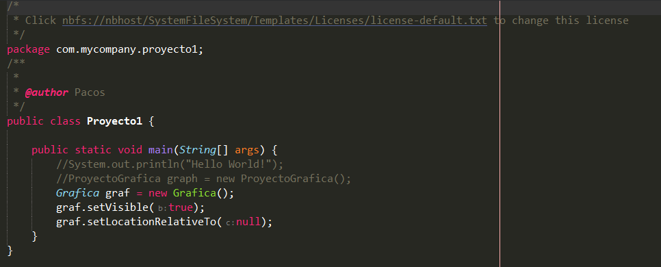
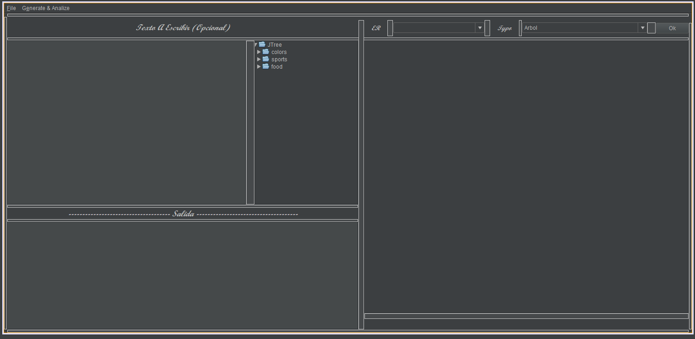

# Proyecto 1
## Manual Técnico
### Introducción
<p style="text-align: justify;">
Dentro del primer proyecto del laboratorio de Organización de Lenguajes  & Compiladores 1 la aplicación realizada fue en base al uso de JFlex y Cup en el lenguaje de programación Java, abordando los conceptos de gramáticas y expresiones regulares para la creación de lo que es el análisis léxico y sintáctico para analizar por consiguiente las cadenas o el archivo de prueba respectivo, la utilización de listas enlazadas para el almacenamiento de los errores, & tokens que son almacenados para su utilización en los que son los árboles y tablas graficadas posteriormente; utlizando asimismo el modo gráfico para obtener aparte de los archivos, generar, graficas, nuevos documentos y observar las imagenes de las expresiones regulares aceptadas.

Se empleo el lenguaje de programación Java como herramienta en la función de las estructuras y analisis, para almacenar la información que la interfaz gráfica le enviaba, y la interfaz gráfica se utilizaba para la obtención y envío de información a las estructuras/actualización de tokens y realización gráficas; se utilizó Graphviz para graficar las estructuras de las tablas0 y árboles.

Se pudo determinar que la implementación de las estructuras y el almacenamiento y/o arreglo de la información obtenida en cada una de ellas no mostro ningún problema durante su ejecución.</p>


### Requisitos del Sistema


>- **_Sistema Operativo:_** Windows 7 o superior
>- **_CPU:_** Intel Pentium D o AMD Athlon 64 (K8) 2.6GHz. (Requisitos Mínimo)
>- **_RAM:_** 600MB
>- **_Lenguaje Utilizado:_** Java
>- **_IDE:_** NetBeans 16
>- **_JDK:_** 19.0 (Open JDK)
>- **_Versión Java:_** 19.0

### Requisitos En el Proyecto (Dependencias Proyecto hecho en MAVEN)


>- **_Versioó CUP:_** 11-b
>- **_Versión CUP-Runtime:_** 11-b
>- **_Versión Gson:_** 2.8.9
>- **_Versión JFlex:_** 1.9.0
>- **_Versión json-simple:_** 1.1.1


### Explicación del Código

#### Analisis Léxico
```
Utiliza las siguientes expresiones regulares para obtener los parámetros a la hora de leer el archivo, obteniendo los errores
léxicos que tenga el archivo.
```



#### Análisis Sintáctico
```
Se encarga de obtener los errores sintácticos y mediante una gramática regular cada en cada producción obtener los datos
requeridos.

Se analizarán las cadenas y separarán los tokens para verificarlos posteriormente.
```







</br>

#### Codigo Java
```
Obtendrá los tokens ingresados, formará los arboles y tablas y analizará o mostrará si la cadena es valida o no es valida.
```
</br>



</br>

```
Por tener varias clases en java se dará un recorrido breve por cada uno:
```
- Las clases que terminen con "nodo" son los nodos que utilizarán las principales para la formación de las tablas y los arboles.
- Las clases AFN, Conjunto, Siguientes, Struct & ER se encargan de recopilar la información y hacer los grafos que obtendrá de las otras clases respectivas.
- La clase Reportes se encarga de hacer el archivo HTML de los errores.
- La clase Proyecto1 solo corre la clase Grafica, que es la que tiene el modo gráfico.

</br>



</br>

>Gráfica del Proyecto



</br>

#### Función al Abrir el programa

- Analiza las carpetas de reportes para ver si tiene o no tiene archivos creados, en caso de tener mas de algun archivo en la sección de reportes, agrega los archivos de imagen de las expresiones regulares creadas.


</br>

#### Funciones Dentro de File

- En el Item "nuevo", limpia la ruta, la consola, y el texto para que uno ingrese un nuevo archivo para analizar, no se puede analizar el archivo sin antes usar la opción de "Guardar Como".


</br>

- En el Item "Open" abre la carpeta de "Archivos" para buscar archivos con extención ".olc" mostrando en la pantalla de texto todo lo que tiene el mismo archivo.


</br>

- En el Item "Save" En el caso de abrir un archivo o haberlo guardado como, busca el archivo y le guarda los nuevos cambios que este tendrá.


</br>

- En el Item "Save As" Guarda el archivo del area de texto como nuevo archivo con extención ".olc".


</br>

- En el Item "Exit" Sale del programa.


</br>

#### Funciones Dentro Generate & Analize

- En el Item "Analizar" con el archivo abierto, analiza linea a linea, guardando los tokens y obteniendo posteriormente las expresiones regulares, tambien analiza que no haya ningun error en el archivo.


</br>

- En el Item "Generar" una vez analizado el archivo genera todos los grafos de los árboles y tablas, tambien generándo el archivo de salida JSON.


</br>

- En el Item "Borrar archivos Directorios" Borra todos los archivos de imagen de los directorios de reportes.


</br>

- En el Item "Abrir Directorio Archivos Prueba" Abre la carpeta donde se encuentran los archivos de prueba, para agregar nuevos.


</br>


### Funciones del Programa

```
Consta de 2 pestañas, 'File' y 'Generate & Analize', tambien tiene 2 combobox para la búsqueda de las imagenes y mostrarlas.
```

</br>

#### File
>- Nuevo: Crea un nuevo archivo con extención olc.
>- Open: Abre un menu desplegable en la carpeta de archivos para abrir archivos de extención olc. 
>- Save: Guarda el achivo con extención olc.
>- Save As: Guarda un nuevo archivo con extención olc.
>- Exit: Sale del programa.

</br>

#### Generate & Analize
>- Analizar: Analiza el archivo abierto, en caso de haber errores los agrega a la tabla de errores.
>- Generar: Genera los grafos de las expresiones regulares, el archivo de salida y muestra cuales cadenas son aceptadas y cuales cadenas no son aceptadas. 
>- Borrar archivos Directorios: Borra todos los archivos del directorio para poner nuevos.
>- Abrir Directorio Archivos Prueba: Abre la carpeta en donde están los archivos de prueba, ya sea para agregar o para borrar archivos.

</br>

### Conclusiones

- La utilización de expresiones regulares ayuda en la simplificación y obtención de mejor forma de expresiones que uno quiere obtener.
- El análisis sintáctico sirve para obtener reglas de el funcionamiento del léxico que uno creó, para el análisis de un archivo.