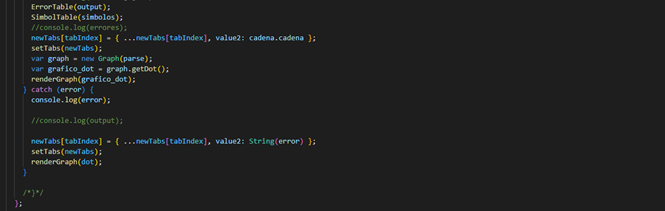

# Proyecto 1
## Manual Técnico
### Introducción
<p style="text-align: justify;">
Dentro del segundo proyecto del laboratorio de Organización de Lenguajes & Compiladores 1, la aplicación realizada fue en base al uso de Jison para el lenguaje de programación de JavaScript, abordando la culminación de conceptos de gramáticas y expresiones regulares para crear un compilador y analizar por consiguiente los datos ingresados, la declaración de variables y cadenas, entre otras, mediante el archivo de prueba respectivo, la utilización de las listas para el almacenamiento de algunas variables dentro del archivo Jison y la utilización de memoria dinámica para almacenar las variables y tokens para la utilización posterior en lo que son las tablas de errores, tablas de símbolos y la generación de un árbol ast que contiene las concatenaciones de las respectivas variables y funciones que contienen valores e instrucciones aceptando mediante las expresiones regulares las variables y funciones correspondientes.
Se empleo el lenguaje de JavaScript como herramienta en la función de las estructuras para el análisis, almacenamiento de la información y la utilización del fronted y backend para el envío y recibimiento de información (en este caso no se utilizaron métodos de POST, UPDATE & GET) todo fue desarrollado para el uso dentro del fronted respecto a las funciones, para el análisis de archivos de información, envío del AST, obtención de tabla de errores, obtención de tabla de símbolos, etc.
Se pudo determinar que la implementación de las estructuras y el almacenamiento y/o arreglo de la información obtenida en cada una de ellas no mostro ningún problema durante su ejecución.
</p>


### Requisitos del Sistema


>- **_Sistema Operativo:_** Windows 7 o superior
>- **_CPU:_** Intel Pentium D o AMD Athlon 64 (K8) 2.6GHz. (Requisitos Mínimo)
>- **_RAM:_** 600MB
>- **_Lenguaje Utilizado:_** JavaScript
>- **_IDE:_** Visual Studio Code
>- **_USO de Framework:_** React


### Requisitos del en el Proyecto (Dependencias Proyecto, React)


>- **_"@emotion/react":_** "^11.10.4",
>- **_"@emotion/styled":_** "^11.10.4",
>- **_"@mui/icons-material":_** "^5.10.3",
>- **_"@mui/material":_** "^5.10.3",
>- **_"@testing-library/jest-dom":_** "^5.16.5",
>- **_"@testing-library/react":_** "^13.4.0",
>- **_"@testing-library/user-event":_** "^13.5.0",
>- **_"@types/jest":_** "^27.5.2",
>- **_"@types/node":_** "^16.18.23",
>- **_"@types/react":_** "^18.0.35",
>- **_"@types/react-dom":_** "^18.0.11",
>- **_"bootswatch":_** "^5.2.3",
>- **_"d3":_** "^7.8.4",
>- **_"d3-selection":_** "^3.0.0",
>- **_"file-saver":_** "^2.0.5",
>- **_"fs":_** "^0.0.1-security",
>- **_"graphviz-react":_** "^1.2.5",
>- **_"jison":_** "^0.4.18",
>- **_"react":_** "^18.2.0",
>- **_"react-dom":_** "^18.2.0",
>- **_"react-draggable":_** "^4.4.5",
>- **_"react-graphviz":_** "^0.7.0",
>- **_"react-router-dom":_** "^6.10.0",
>- **_"react-scripts":_** "5.0.1",
>- **_"react-zoom-pan-pinch":_** "^3.0.7",
>- **_"web-vitals":_** "^2.1.4",
>- **_"webpack":_** "^5.81.0"


### Explicación del Código

#### Analisis Léxico
```
Utiliza las siguientes expresiones regulares para obtener los parámetros a la hora de leer el archivo, obteniendo los errores léxicos que tenga el archivo.
```


#### Precedencia de Operadores
```
Sirve para obtener un orden a la hora de hacer las operaciones de valores, cuales tienen mayor “relevancia” o cuales operar antes de otros dentro de una función u orden.
```


#### Análisis Sintáctico
```
Se encarga de obtener los errores sintácticos y mediante una gramática regular cada en cada producción obtener los datos requeridos.

Se analizarán las cadenas y separarán los tokens para verificarlos posteriormente.
```


</br>

#### Codigo JavaScript
```
Obtendrá los tokens ingresados, formará los árboles y tablas y analizará o mostrará si las expresiones y funciones son aceptadas (para posteriormente correr el código).
```
</br>


</br>

```
Se exportarán clases las cuales servirán para su posterior uso:
```
- Las clases en la que se pasan los parámetros (en general) son la TipoOperaciones, TipoValores, Tipados e Instrucciones dentro del archivo jison.
- La clase index.js es la que corre la aplicación.
- Al abrir la carpeta del proyecto usar el comando “npm install” o “npm i” para instalar todas las librerías y módulos que requiere para usar el programa.
- Con “npm start” corre el programa abriendo en el “localhost:3000” corra el proyecto.

</br>


</br>

>Fronted del proyecto


</br>

#### Función al Abrir el programa

- Al correr el servidor nos abre en el servidor local el puerto en donde uno va a usar la aplicación.


</br>

#### Funciones del Programa

- Consta de 3 botones, básicos para el análisis, guardado y abrir archivos..

</br>

- Abre el explorador de medios para que el usuario busque archivos de extensión .tw
- Al seleccionar el archivo, en el primer cuadro de texto muestra el contenido del archivo, este usa una función llamada handleOpenFile el cual se encarga de obtener la información del archivo y enviar todo el contenido del mismo a el cuadro de la pestaña que este abierta (si esta el usuario en la pestaña 1, en esa se mostrará el contenido, en caso de ser otra pestaña, solo esa tendrá el contenido del archivo)


```
Este código hace que cuando el usuario abre una pestaña (que está para abrir nuevas pestañas en la parte superior derecha de la ventana) esta misma tenga el un valor tanto los TextArea 1 y 2, evitando compartir información con los otros de las otras pestañas, pudiendo así el usuario tener abiertas varias pestañas independientes.
```

</br>

#### Analyze

- Es de las más ¿complejas?, se encarga de obtener toda la información del cuadro de texto abierto en la pestaña y envía el contenido de la misma a una función que pasa posterior por 2, para parsear el contenido y para generar el árbol AST, la tabla de errores y la tabla de símbolos, sin mencionar la salida que también es generada por la misma.

</br>





</br>


### Save File

- Guarda el archivo como uno nuevo de extensión .tw

</br>


```
En caso de que el archivo tenga errores, lo mostrará en consola y en la tabla de errores
```

</br>


</br>

### Conclusiones

- La utilización de expresiones regulares ayuda en la simplificación y obtención de mejor forma de expresiones que uno quiere obtener.
- El análisis sintáctico sirve para obtener reglas de el funcionamiento del léxico que uno creó, para el análisis de un archivo.