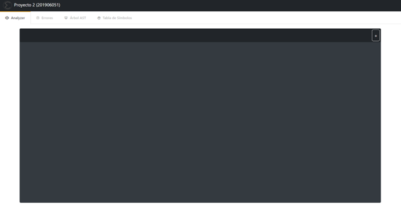
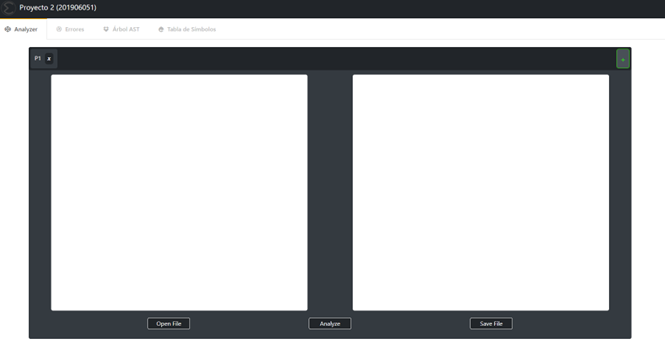
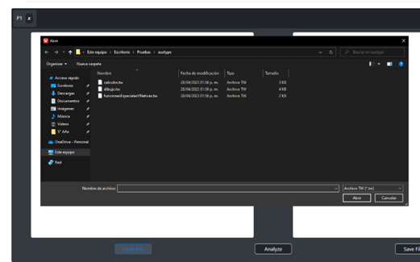
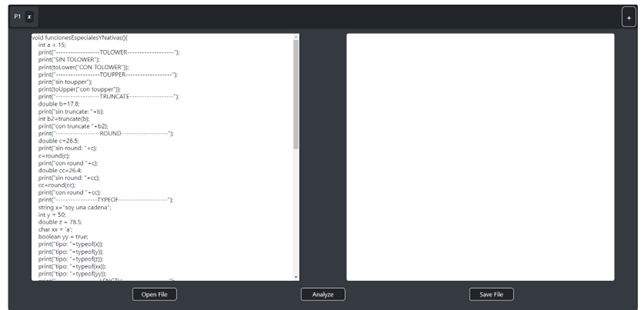
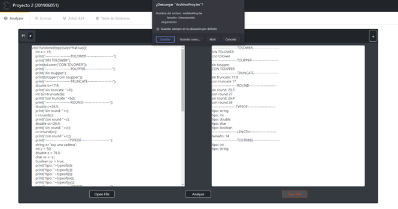
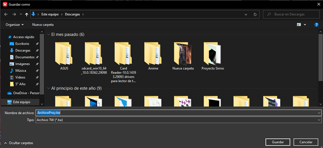
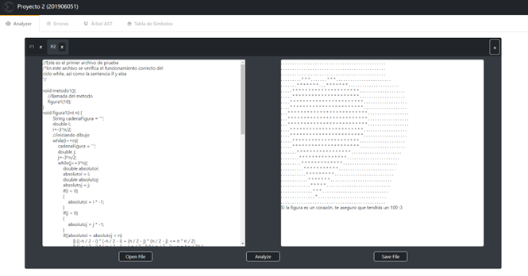
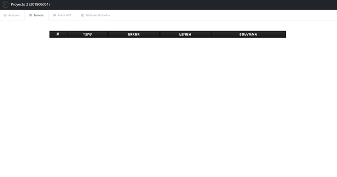
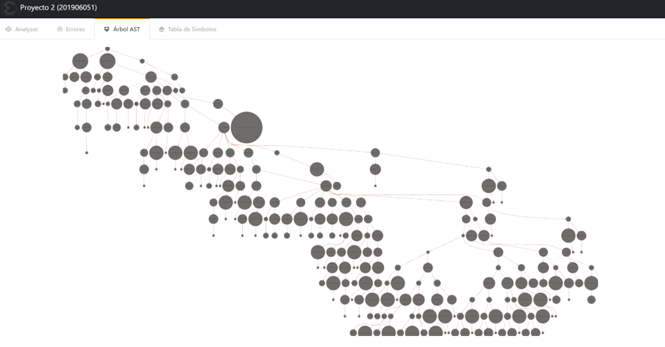
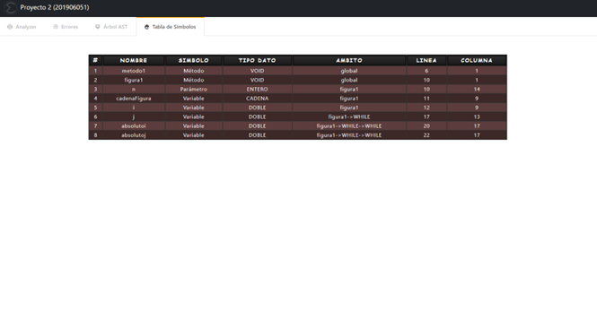

# Proyecto 2 
## Manual de Usuario
### Introducción

Dentro del último proyecto del laboratorio de Organización de Lenguajes & Compiladores 1 se mostrará el modo en el que funciona el programa mediante una interfaz gráfica y sus subfunciones.

Se empleo el lenguaje de JavaSript para la creación de la interfaz gráfica del programa en el que tiene diferentes funciones en el mismo para lo que es el análisis, la generación y otros más para su respectivo funcionamiento; se utilizó un software para obtener tablas y graficar el árbol AST.

Se pudo determinar que la implementación de las estructuras y el almacenamiento y/o arreglo de la información obtenida en cada una de ellas no mostro ningún problema durante su ejecución.

### Requisitos del Sistema

>- **_Sistema Operativo:_** Windows 7 o superior
>- **_CPU:_** Intel Pentium D o AMD Athlon 64 (K8) 2.6GHz. (Requisitos Mínimo)
>- **_RAM:_** 600MB
>- **_Lenguaje Utilizado:_** JavaScript
>- **_IDE:_** Visual Studio Code
>- **_USO de Framework:_** React

### Requisitos del en el Proyecto (Dependencias Proyecto, React)

>- **_"@emotion/react":_** "^11.10.4",
>- **_"@emotion/styled":_** "^11.10.4",
>- **_"@mui/icons-material":_** "^5.10.3",
>- **_"@mui/material":_** "^5.10.3",
>- **_"@testing-library/jest-dom":_** "^5.16.5",
>- **_"@testing-library/react":_** "^13.4.0",
>- **_"@testing-library/user-event":_** "^13.5.0",
>- **_"@types/jest":_** "^27.5.2",
>- **_"@types/node":_** "^16.18.23",
>- **_"@types/react":_** "^18.0.35",
>- **_"@types/react-dom":_** "^18.0.11",
>- **_"bootswatch":_** "^5.2.3",
>- **_"d3":_** "^7.8.4",
>- **_"d3-selection":_** "^3.0.0",
>- **_"file-saver":_** "^2.0.5",
>- **_"fs":_** "^0.0.1-security",
>- **_"graphviz-react":_** "^1.2.5",
>- **_"jison":_** "^0.4.18",
>- **_"react":_** "^18.2.0",
>- **_"react-dom":_** "^18.2.0",
>- **_"react-draggable":_** "^4.4.5",
>- **_"react-graphviz":_** "^0.7.0",
>- **_"react-router-dom":_** "^6.10.0",
>- **_"react-scripts":_** "5.0.1",
>- **_"react-zoom-pan-pinch":_** "^3.0.7",
>- **_"web-vitals":_** "^2.1.4",
>- **_"webpack":_** "^5.81.0"

### Funcionamiento del programa

>Inicio del Programa

 

El programa al correr el servidor, abriendo el servidor local en donde se va a ejecutar el código para el uso de la aplicación

Programa Abierto.

 

>Abrir Fichero

A la hora de querer abrir un fichero, con el botón de Open File abriendo el explorador de archivos (todos los archivos que abre son de extensión "tw").

 

Una vez abierto el archivo lo muestra en la pantalla de texto lo que tiene el archivo.

 

>Guardar Archivo

En caso de querer cambiar el archivo y guardarlo se pueden agregar más líneas (en caso de que uno requiera o quiera agregar más y se utiliza la opción de guardar "Save File").

 

En el caso de querer guardar el archivo como uno nuevo se utiliza la opción "Save As", abriendo una pestaña emergente para guardar el archivo (guarda con la extensión el archivo).

 

>Analizar Entrada

Agarra el contenido del TextArea y empieza el proceso de análisis, generando de esta forma el árbol, tablas de errores y sintácticos y la salida de consola.

 

### Funciones del Programa

#### Open File
>- Abre el archivo por medio del explorador de archivos

 

#### Analize
>- Analiza el archivo de la pestaña abierta y genera todo lo que es requerido (tablas de erores y símbolos, árbol y salida en consola)

 

#### Save File
>- Guarda el archivo de la pestaña abierta en donde el usuario quiera

 

### Conclusiones

- La utilización de expresiones regulares ayuda en la simplificación y obtención de mejor forma de expresiones que uno quiere obtener.
- El análisis sintáctico sirve para obtener reglas del funcionamiento del léxico que uno creó, para el análisis de un archivo.

### Recomendaciones

- Leer el manual antes de usar el programa.